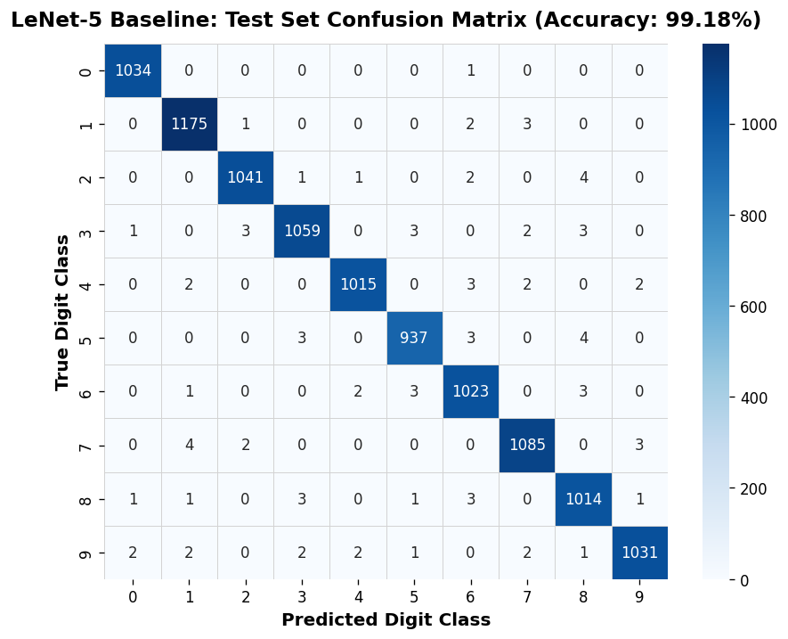
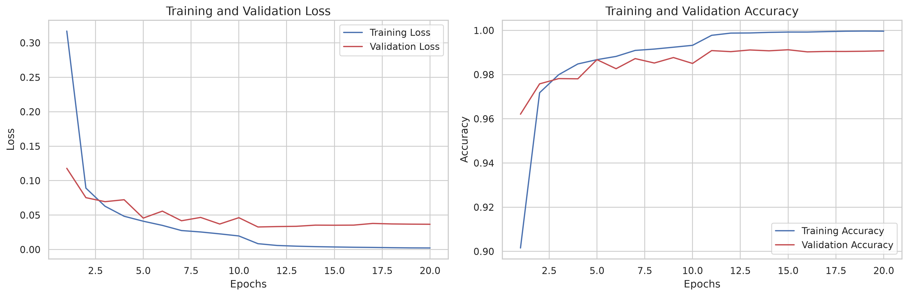

# CNN Baseline Results (v1_mnist)

## LeNet-5 on MNIST

### Results

- **Test accuracy:** 99.18% (10,414 / 10,500)
- **Misclassified samples:** 86
- **Macro F1-score:** 0.9918
- **Feature layer:** `fc2`
- **Embedding dimension:** 84

### Error Analysis

The model made **86 errors** across 10,500 test samples.

Most frequent class confusions included:

- 7 → 1: 4 samples
- 5 → 8: 4 samples
- 2 → 8: 4 samples
- 7 → 9: 3 samples
- 5 → 6: 3 samples

Digit **0** performed particularly well, with only one misclassification.

The confusion matrix is strongly diagonal, showing that most test samples were classified correctly. The remaining errors are concentrated among a small number of visually similar digit classes.

### Main Observation

LeNet-5 provides a strong MNIST baseline. The saved **84-dimensional `fc2` embeddings** are used as input to NNSOM for SOM training, BMU mapping, quantization-error analysis, and class-cluster visualization.

## Figures

### Confusion Matrix

### Training Curves

For additional plots and sample-level analysis, see the  
[`v1_mnist Cookbook`](../../../cookbooks/v1_mnist/cnn_baseline.ipynb).
